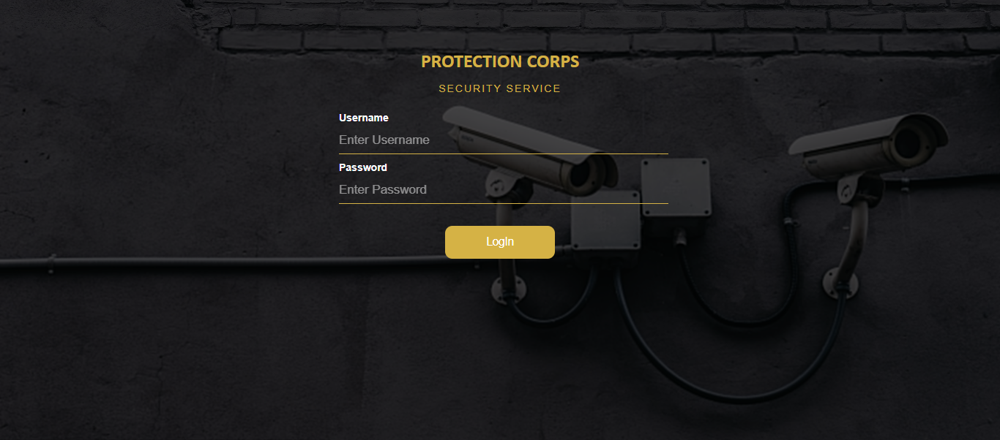
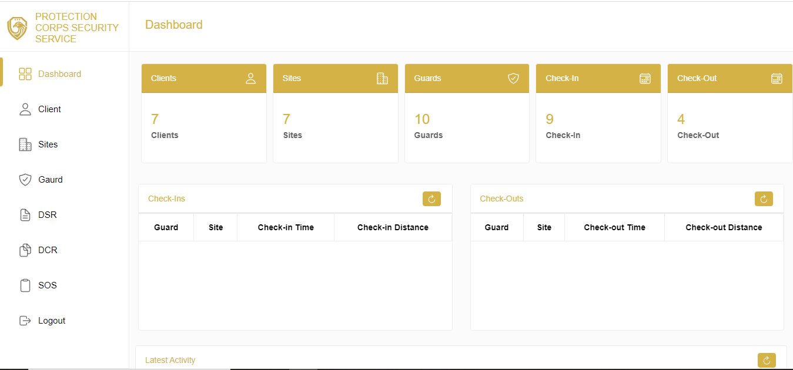
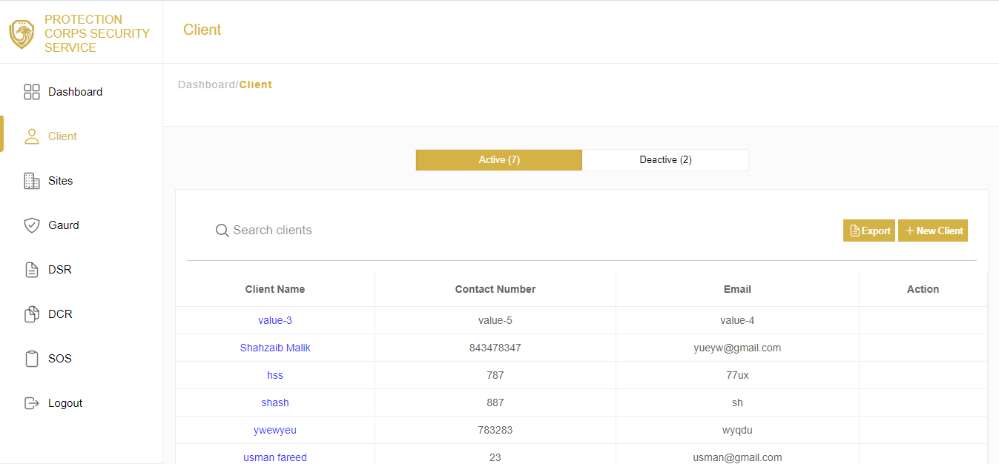

# Secutity Mangement App
this Software is designed specially for the comapnies who provide security guard to other organizations , school and any other location, this app facilitate the manger to keep track of guards with their locations , can check wether the guard is on duty or not. in case of any suspecious activity guard can take the picture of and admin can easly send check .

  


## Admin Features
- Complete Dashboard of graphicial representation of all data like active guards , late checking , monthly report of guards 
- Admin can see the live location of guards. 
- Admin can set the monthly, weekly and daily duties of the guard 
- admin can check the the images posted by the guards. 
- admin can see total duties hours of the guards by monthly, weekly and daily basis
- admin can verify the gurads who late check in the duties. 

## Guard App
- Very easy to use 
- gurads can login by the givien by the admin 
- guards can check in and checkout of assigned duty 
- guards can see the post the images of their assign duties 
- location sepecific of checkin
-  


## Operating System 
this Software support All operating System 
- Android
- IOS
- Desktop
- Web
## Admin Screenshots

 - secreen shot1
 



## Guard Screenshots
.png)

## Technologies & Lnaguages 

**Client:** Ionic 6.0 , Capacitor 3.0 & above , Angular , Java Script 

**Server:** REST API's (SlimFramework), PHP 


## Acknowledgements

 - [Learn@Earn Professional Institute Of Computer Science](https://learn2earnn.com)
 - [Learn2Earn Blog](https://ioniccapacitor.com)
 


## Demo
### Admin Demo

 - username : admin
 - password : 1122
[Security Admin app](https://learn2earn-security-admin.netlify.app).


 ### Guard Demo
 - username : haroon
 - password : 1234
[Security Gurad app](https://learn2earn-security-guard-app.netlify.app).


## Authors

- [Learn2Earn Software Solutions](https://github.com/orgs/Learn2Earn-Team)


## Installation

To Install the Project in Directory. Clone With Following link 

```bash
  https://github.com/Learn2Earn-Team/Property-Management-System.git
```
    
## Build For Android

To generate the APK for the Android runn this command 


```bash
  npm run android
```

this command will open Android Studion Software 
and there you will simply build the APK.


## FAQ

#### Can We test the App ?

yes you can install by using upper instruction 

#### What is user name and password ?

Yes you can login by using below credentials
username : admin
password : 2233
role : admin

#### Can We buy Monthly Subscriptions?
yes you can buy the software on Monthly Subscriptions.
for plan you can visit us.
- [Learn2Earn Software Solutions](https://github.com/orgs/Learn2Earn-Team)

#### Can we buy through Onetime Payment?

yes you can also buy through one time payment.
## 🚀 About Us
We are Complete Software house , Running Since 2018 with the team of more then 20 peoples.
we are wroking on different platforms and try to give all services to the clinet 


## Services 
We provide multiple Services
- Android app 
- Ios app 
- Web Development 
- Graphics Designind 
- Animated Videos 
- Digital Marketing 
## 🔗 Links
[](https://learn2earnn.com/L2E_Portfolio.html)
[](https://www.linkedin.com/in/learn2earn-software-solutions-2b62b9262/)
[](https://web.facebook.com/Learn2Earn.Institute)


## Support

For support, email support@learn2earnn.com or Contact us on  [Fiverr](https://www.fiverr.com/learn2earnpk).

